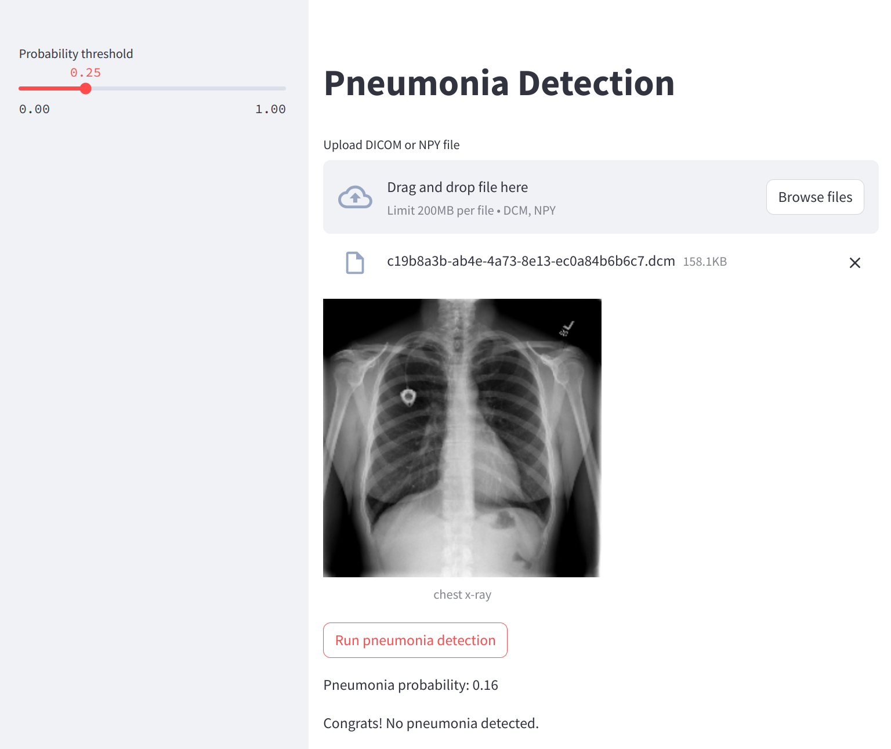

# Pneumonia detection API

The pneumonia detection app is designed to detect pneumonia in medical images. It utilizes machine learning algorithms to analyze chest X-rays. This app can assist medical professionals in the early detection and diagnosis of pneumonia.

## Running the App

To run the pneumonia detection app, you will first need to install the pneumonia package. For this you need to clone this repository and install the pneumonia package. Here are the steps:

```bash
git clone https://github.com/borbalita/medical.git
cd medical
pip install .
```

Now you can run the pneumonia detection app by executing the following command.

```bash
streamlit run app.py
```

## App usage

To upload an image to the pneumonia detection app press the 'Browse files' button. The currently supported file formats are dcm and npy. The selected image will be displayed in the app. To classify the image press the 'Run pneumonia detection' button.



## Probability threshold

Under the hood the pneumonia detection app computes the probability that the patient in the x-ray image has pneumonia. If this probability is above a certain threshold, the patient is diagnosed with pneumonia. The default threshold value is 0.25 and it can be adjusted by moving the slider in the sidebar.

## Model

The underlying pneumonia classifier model was created with the [dev/Pneumonia.ipynb](dev/Pneumonia.ipynb) notebook. Feel free to experiment with the hyperparameters and train your own model. The notebook automatically saves the model parameters and the standardisation parameters to the [parameters](parameters) folder. To use the newer model with the pneumonia detection app, the `MODEL_PATH` and `PARAM_PATH` variables of the [app.py](app.py) script need to be asjust.
